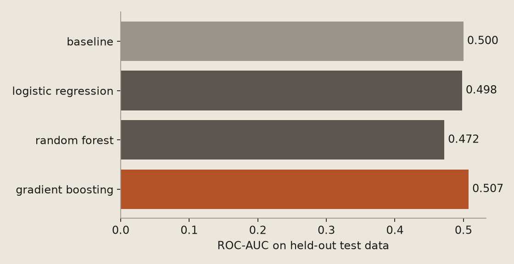
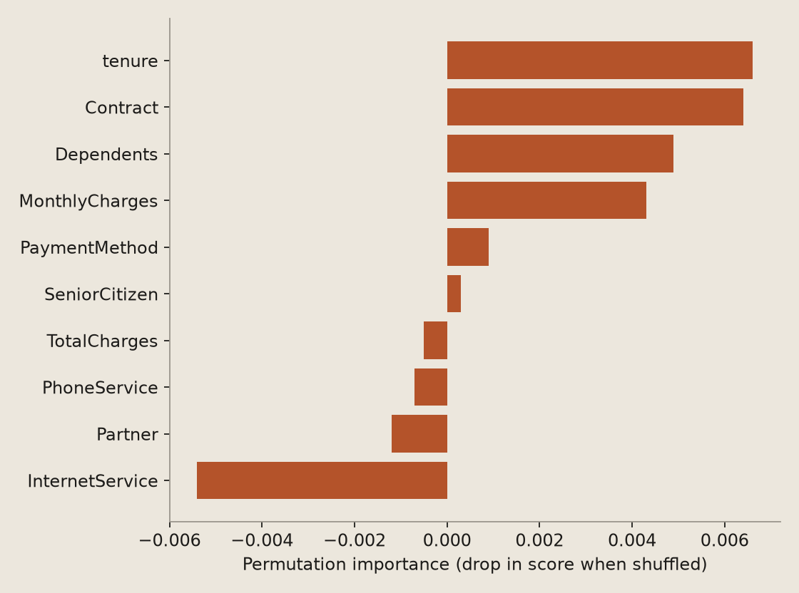
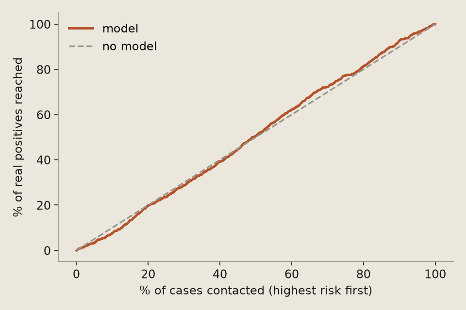

# بانک و مؤسسه‌ی مالی — پنهان ماندن نرخ واقعی ریزش مشتریان خرد و از دست رفتن سپرده‌ها

> رادار #2 · هومات · حکم: **ضعیف** — مدل عملاً از حدس بهتر نیست؛ مطالعه‌ی موردی نمی‌شود.

## مسئله

بانک‌های خرد (Retail Banking) به دلیل تمرکز بر معیارهای سنتی و سطحی، متوجه خروج تدریجی سپرده‌ها و انتقال آنها به رقبا نمی‌شوند. گزارش‌ها نشان می‌دهد اعداد رسمی وفاداری و ریزش (Attrition) گمراه‌کننده هستند زیرا مشتریان به جای بستن حساب، موجودی خود را به چند مؤسسه دیگر منتقل می‌کنند. این پدیده باعث می‌شود بخش سودآور سپرده‌ها بدون هشدار قبلی تخلیه شود و ارزش طول عمر مشتری (Customer Lifetime Value) سقوط کند.

**معیار موفقیت کسب‌وکار:** شنااسایی حداقل ۷۵ درصد از مشتریان مستعد ریزش پیش از خروج کامل سپرده

## داده

- منبع: `tayaee/bank-customer-churn-prediction` (داده‌ی عمومی، نه داده‌ی مشتری)
- ۴٬۷۰۴ سطر قابل استفاده؛ آموزش ۳٬۷۶۳، آزمون ۹۴۱
- تقسیم: random stratified 80/20
- هدف: `Churn` (دسته‌بندی)

توزیع هدف: `0`: ۲٬۳۸۶، `1`: ۲٬۳۱۸

## نتیجه

- بدون مدل ROC-AUC برابر ۰٫۵ است؛ گرادیان بوستینگ به ۰٫۵۱ رسید (بازه‌ی اطمینان ۹۵٪: ۰٫۴۷ تا ۰٫۵۴).
- از ۲۰٪ مواردی که مدل پرریسک‌تر دانست، ۴۹٪ واقعاً مثبت بودند (میانگین کل: ۴۹٪).

| مدل | اعتبارسنجی متقاطع ۵تایی (ROC-AUC) | آزمون (ROC-AUC) |
|---|---|---|
| بدون مدل (پایه) | ۰٫۵ ± ۰ | ۰٫۵ |
| رگرسیون لجستیک | ۰٫۴۹۸ ± ۰٫۰۲۲ | ۰٫۴۹۸ |
| جنگل تصادفی | ۰٫۴۹۸ ± ۰٫۰۱۲ | ۰٫۴۷۲ |
| گرادیان بوستینگ | ۰٫۵ ± ۰٫۰۱۵ | ۰٫۵۰۷ |

## مهم‌ترین عامل‌ها (اهمیت جایگشتی روی داده‌ی آزمون)

1. `tenure` — ۰٫۰۰۶۶
2. `Contract` — ۰٫۰۰۶۴
3. `Dependents` — ۰٫۰۰۴۹
4. `MonthlyCharges` — ۰٫۰۰۴۳
5. `PaymentMethod` — ۰٫۰۰۰۹
6. `SeniorCitizen` — ۰٫۰۰۰۳
7. `TotalCharges` — −۰٫۰۰۰۵
8. `PhoneService` — −۰٫۰۰۰۷
9. `Partner` — −۰٫۰۰۱۲
10. `InternetService` — −۰٫۰۰۵۴

## پاک‌سازی

- `customerID` — شناسه

**غربال نشت داده:**

- موردی دیده نشد

## کیفیت داده و تفسیر مدل

- **رکورد ناهنجار (pyOD/ECOD):** ۱۰٪ از رکوردها الگوی غیرعادی دارند
- **رانش داده بین آموزش و آزمون (Evidently):** ۰ ستون از — (۰٪)
- **ستون متنی (spaCy):** `customerID` — ۴۰۰ توکن، ۵۸٫۸٪ اسم؛ موجودیت‌ها: GPE: ۱۱، ORG: ۱۱، NORP: ۴، PERSON: ۳، DATE: ۱
- **جست‌وجوی خودکار مدل (scikit-learn HalvingRandomSearchCV):** بهترین امتیاز ۰٫۴۹۱ در برابر ۰٫۵۰۷ از مدل انتخابیِ خط لوله
- **لینت کد (ruff 0.16.8):** ۱ ایراد

## یادداشت صادقانه

این دیتاست در واقع دیتاست معروف ریزش مشتریان مخابرات (Telecom Churn) است که به اشتباه یا با تغییر نام ستون‌ها به عنوان دیتای بانکی معرفی شده است. ستون‌هایی مثل PhoneService و InternetService هیچ ربطی به بانکداری ندارند و جای خالی داده‌های حیاتی بانکی مانند مانده حساب، نرخ سود و گردش مالی به شدت حس می‌شود. با این حال، به صورت فرمال می‌توان یک مدل پیش‌بینی ریزش عمومی روی آن پیاده‌سازی کرد.

کمبود داده: داده‌های تراکنشی ریز (مانند تعداد و مبلغ تراکنش‌های ماهانه اخیر)، روند تغییرات موجودی حساب در بازه‌های زمانی ۳۰ و ۹۰ روزه، و نوع حساب‌های بانکی. بدون این داده‌ها، شناسایی 'افت تدریجی موجودی' غیرممکن است.

این عددها روی داده‌ی عمومی به دست آمده‌اند و نشان می‌دهند روش کار می‌کند؛ روی داده‌ی یک کسب‌وکار مشخص باید دوباره سنجیده شوند.

## بازتولید

```
pip install -r requirements.txt
python pipeline.py     # یا: dvc repro
```





## منابع و شفافیت فنی

- **شاخه:** یادگیری ماشین کلاسیک — دسته‌بندی با نظارت
- **مدل انتخاب‌شده:** گرادیان بوستینگ
- **داده:** Hugging Face Datasets — tayaee/bank-customer-churn-prediction — https://huggingface.co/datasets/tayaee/bank-customer-churn-prediction
- **pandas** (خواندن و پاک‌سازی داده‌ی جدولی) — https://pandas.pydata.org/docs/
- **scikit-learn** (مدل‌های پایه، خط‌لوله، اعتبارسنجی متقاطع و سنجه‌ها) — https://scikit-learn.org/stable/
- **matplotlib** (رسم نمودار) — https://matplotlib.org/stable/
- **pyOD** (بیش از چهل الگوریتم کشف داده‌ی پرت و ناهنجار) — https://pyod.readthedocs.io/
- **feature-engine** (تبدیل ویژگی سازگار با خط‌لوله: دسته‌ی کم‌تکرار، پرت، جاگذاری) — https://feature-engine.trainindata.com/
- **Evidently** (سنجش رانش داده (drift) بین داده‌ی قدیمی و تازه) — https://docs.evidentlyai.com/
- **plotly** (نمودار تعاملی HTML برای تحویل قابل کاوش به مشتری) — https://plotly.com/python/
- **spaCy** (پردازش متن صنعتی: موجودیت، وابستگی، دسته‌بندی) — https://spacy.io/usage
- **pydantic** (اعتبارسنجی نوع داده در ورودی و خروجی) — https://docs.pydantic.dev/
- **ruff** (لینتر و فرمت‌کننده‌ی بسیار سریع پایتون) — https://docs.astral.sh/ruff/
- Google Dataset Search — https://datasetsearch.research.google.com/

**مقاله‌ها و مستندهای مرجع روش:**
- Zhao et al., PyOD: A Python Toolbox for Scalable Outlier Detection, JMLR 2019 — https://arxiv.org/abs/1901.01588
